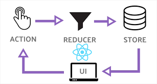

## Instalación y puesta en marcha
Es necesario tener node instalado. Se recomienda tener la última LTS. En el momento de redacción de este documento se ha probado con 12.18.0 (LTS) y 13.9.0 (NO LTS)
<pre>
npm i
</pre>

Para levantar la aplicación debemos ejecutar:

<pre>
npm start
</pre>

## Levantar servidor en local sin necesitad de instalación:
<pre>
npx http-server
</pre>
Ese comando hace que no persista la instalación del paquete http-server, pero permite levantar un servidor web en la ruta en la que se ha ejecutado el comando build
<pre>
npm run serve
</pre>

## Proyecto

El proyecto está basdo en la tecnología WebComponent. Es el estandar web para diseñar componentes/controles web, [mozilla](https://developer.mozilla.org/es/docs/Web/Web_Components) lo define como _"Paquete de diferentes tecnologías que te permiten crear elementos personalizados reutilizables — con su funcionalidad encapsulada apartada del resto del código — y utilizarlos en las aplicaciones web"_

Para trabajar con webcomponents podríamos haberlo hecho con código JS puro (VanillaJS) o utilizando alguna librería que nos facilite su implementación y nos aporte alguna característica a mayores. En este caso se ha optado por utilizar [litelement](https://lit-element.polymer-project.org/), es una tecnología creada por Google y nos ofrece la posibilidad de trabajar con Typescript.

Uno de los puntos más importantes a tener en cuenta para depurar / mantener el proyecto es el [ciclo de vida](https://lit-element.polymer-project.org/guide/lifecycle) de los componentes con litelement, y también destacar que se ha descartado trabajar con shadow dom, de ahí que podamos trabajar con el fichero CSS styles.css y que cada componente sea "editable" desde fuera.

## Compilación

El proceso de compilación se hace a través de [webpack](https://v4.webpack.js.org/) en la versión 4. Tenemos dos scripts que nos permiten compilar la aplicación que deseamos obtener. El código que se ha utilizado para definir el proceso de compilación está en _./webpack_  Ahí se puede ver que tenemos el fichero:

- webpack.base.js

En la carpeta _./src/index.html_ tenemos el fichero html donde se define el punto de entrada de cada aplicación, en la que se incluye el webcomponent que contiene el resto, y define la aplicación que queremos utilizar.
Hay que tener en cuenta que estamos trabajando con Webcomponents en TS y el código resultante debe ser transpilado a ES5. El proceso de compilación empieza transpilando de TS a es6 (tsconfig.json), una vez tenemos el código en ES6 se utiliza babel para incluir los polyfills necesarios para transpilarlo a ES5.

El día que ya no se necesite IE11 se podrán retirar la mayoría de polyfills y desplegar las aplicaciones en ES6, obteniendo una mayor performance y una disminución considerable en el tamaño de los ficheros js resultantes. Para llevar a cabo dicha acción debemos fijarnos en webpack.base.js en el array en el que incluimos polyfillsIe:

- 'core-js/features/promise' --> Ofrece compatibilidad con Promise
- 'whatwg-fetch'  --> Permite realizar llamadas ajax con fetch y no con XMLHttpRequest
- 'core-js/stable'  --> Conjunto de funcionalidades necesarias para IE11 (principalmente para trabajar con los "nuevos" métodos de los arrays; filter, map, reduce, etc..)
- 'ie11-custom-properties' --> Ofrece compatibilidad para poder utilizar custom properties en CSS (variables de CSS) en los navegadores que todavía no han implementado dicho estandar (IE11).
- 'custom-event-polyfill'  --> Permite la emisión de eventos nativos del navegador [Events](https://developer.mozilla.org/en-US/docs/Web/Guide/Events/Creating_and_triggering_events)
- 'regenerator-runtime/runtime' --> Este polyfill sigue siendo necesario para poder trabajar con navegadores que no permiten trabajar con la importación de [módulos](https://www.npmjs.com/package/regenerator-runtime) de forma dinámica desde el navegador

## Patrón redux

Se ha optado por desarrollar la aplicación bajo este patrón por su facilidad a la hora de detectar cambios en el estado de la aplicación desde varios componentes y depurar situaciones concretas que hayan producido un error. No se debe confundir esa facilidad con fácil aprendizaje. Para trabajar con este patrón es necesario tener un conocimiento de qué hace, qué aporta y cómo nos puede ayudar a depurar la aplicación.
Como resumen podemos entender Redux como un patrón que nos ofrece un "almacén de datos" (store) en la que está la verdad absoluta del estado de nuestra aplicación. En dicha store se van añadiendo "fotografías" por cada cambio que se realice en los datos / interacción del usuario. Esto se puede ver mucho mejor si se instala la extensión del navegador Redux DevTools:
- [Chrome](https://chrome.google.com/webstore/detail/redux-devtools/lmhkpmbekcpmknklioeibfkpmmfibljd?hl=es)
- [Firefox](https://addons.mozilla.org/en-US/firefox/addon/reduxdevtools/)

Protagonistas que intervienen:

- store: Almacén de datos que refleja el estado actual de la aplicación
- reducer: Función en la que se define el cambio de estado de la aplicación
- action: Disparador de un cambio de estado en la aplicación

[Aquí](https://es.redux.js.org/docs/basico/ejemplo-todos.html) podemos encontrar un ejemplo completo (y básico) de cómo funciona este patrón. El ejemplo está basado en React, pero es totalmente independiente de la librería js, y en este caso se ha usado la misma librería que se suele usar en React.js.

Conocer redux es imprescindible para entender el flujo de esta aplicación. Es importantísimo entender que cada vez que un componente ejecuta una acción (dispatch), se crea un nuevo estado (una nueva fotografía del estado actual) devolviendo un nuevo estado (no una copia del anterior). Esto se lleva a cabo en los reducers, con el siguiente código:

<pre>
[...]
return {
  ...state,
  propertyToModify: newValue,
  objectToModify : {
    ...objectToModify,
    propertyToModify: newValue,
  }
  arrayToModify: [...arrayToModify]
}
[...]
</pre>

En este código tenemos tres maneras (que no son todas) de cómo clonar un objeto o un array con ES6.En el caso de propiedades primitivas, basta con actualizar el valor, internamente el navegador genera un nuevo objeto/variable.

Para implementar la característica REHACER / DESHACER (CTRL+Y / CTRL+Z) este patrón ha venido perfecto, ya que simplemente hay que generar una colección de estados pasados, una propiedad "presente" y una colección de estados futuros. De esta manera, como los componentes reaccionan a cambios en la store (almacén de datos, A.K.A fotografía estado aplicación). En esta aplicación (ambas) solo se han querido gestionar la temporalidad en ciertas acciones del listado de acciones realizadas (src\redux\actions\action.reducer.ts)

<pre>
interface IRedoUndoState<T> {
  past: Array < T>;
  present: T;
  future: Array < T>;
}
</pre>

Para implementar esta funcionalidad hemos hecho uso de la librería [redux-undo](https://github.com/omnidan/redux-undo) que nos facilita un reducer de alto nivel (high order reducer) y que incluye ciertas funcionalidades potentes; Nos permite convertir un reducer en "undoable", filtrar los actions que generan una copia de T en past /present / future, y fijar un estado inicial para no deshacer más del estado inicial de la aplicación.

